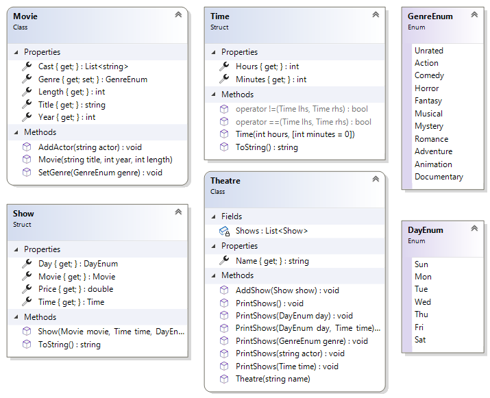
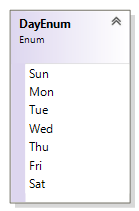
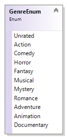

# Implement a Theatre Application 75 Marks

[](https://codespaces.new/ttran375/comp123-lab18)

[](https://github.com/ttran375/comp123-lab18/actions/workflows/main.yml)

This is the most complex application that you have seen so far. It
comprises of six user defined types: three classes, a struct and two
enums. This assignment attempts to simulate a simple version of a
Theater application. In this application the user can search for a movie
based on genre, name of actor, the time of the day and the day of the
week.



You should define your types in the following order: the two enums, Time,
Movie, Show and then Theater. In the test harness, you will create a
theater, some movies and some shows. You will add movies to the show and
then add the shows to the theater. Then, you will perform some simple
queries on this collection.

## The MovieDay Enum 2 Marks



This
type represents the days of the week and is comprised of seven
constants. The constants are the first three letters of the day of the
week.

It is not necessary to assign values to the members.

Also, you do not have to use the <span class="mark">\[Flags\]</span>
attribute to decorate this type.

## The GenreEnum Enum 5 Marks



This
type represents the various categories of movie. Because a movie may
fall under multiple categories, you will have to use the
<span class="mark">\[Flags\]</span> to decorate this enum.

The bit-wise operator is a single bar "\|" and it is used to co mbine
more than one genre. E.g. **<span class="mark">Genre</span>Enum** genre
= **<span class="mark">Genre</span>Enum**.Action \|
**<span class="mark">Genre</span>Enum**.Romance \|
**<span class="mark">Genre</span>Enum**.Comedy;

For this to work correctly, you will have to assign appropriate values
for each name. Appropriate values are powers of 2, i.e., 0, 1, 2, 4, 8,
16, 32 etc.

## The Time Struct 13 Marks

This type represents a time when a movie is schedule to be shown.

<table>
<colgroup>
<col style="width: 100%" />
</colgroup>
<thead>
<tr class="header">
<th><p><strong>Time</strong></p>
<p>Struct</p></th>
</tr>
</thead>
<tbody>
<tr class="odd">
<td><strong>Fields</strong></td>
</tr>
<tr class="even">
<td></td>
</tr>
<tr class="odd">
<td><strong>Properties</strong></td>
</tr>
<tr class="even">
<td><blockquote>
<p>+ «setter absent» Hours : <mark>int</mark></p>
<p>+ «setter absent» Minutes : <mark>int</mark></p>
</blockquote></td>
</tr>
<tr class="odd">
<td><strong>Methods</strong></td>
</tr>
<tr class="even">
<td><blockquote>
<p>+ «Constructor» Time(</p>
<p>hours : <mark>int</mark>,</p>
<p>minutes = 0 : <mark>int</mark>)</p>
<p>+ ToString() : <mark>string</mark></p>
<p>+$ operator ==(lhs : <mark>Time</mark>, rhs : <mark>Time</mark>) :
<mark>bool</mark></p>
<p>+$ operator !=(lhs : <mark>Time</mark>, rhs : <mark>Time</mark>) :
<mark>bool</mark></p>
</blockquote></td>
</tr>
</tbody>
</table>

### Fields

All the properties have public getters and private setters and are
self-explanatory.

### Properties

The two properties are public without setters.

1. **Hours** – this int represents the property hours. No setter.

2. **Minutes** – this int represents the property minutes. No setter.

### Constructor

1. **<span class="mark">public Time(int hours, int minutes =
    0)</span>** – This public constructor takes one mandatory and one
    optional parameters and assigns them to the appropriate properties.
    You do not need to do any error checking. The second parameter is
    optional.

### Methods

1. **<span class="mark">public override string</span> ToString()** –
    This method overrides the same method of the Object class. It does
    not take any parameter but return a string representation of itself.
    You decide on the format for the output.

2. **<span class="mark">public static operator bool</span>
    ==(**<span class="mark">Time lhs, Time rhs</span>**)** – This method
    overrides the equality operator. This method will return true if the
    difference between the two arguments is less than or equal to 15
    minutes, otherwise it returns false. This method is used in the
    **PrintShows(<span class="mark">Time time</span>)** method of the
    Theater class.  
    If you cannot figure out the 15 minutes difference, then check for
    equality of the fields **hours** and **minutes**.  
    One way of figuring out the 15 minutes difference is to convert the
    hours and minutes fields to just a minute value. If you do the same
    to both objects, you can determine how close the two objects are.
    \[Math.Abs(value1 – value2)\]  
    e.g. 3:55 == 4:05 and 4:10 ≠ 4:30

3. **<span class="mark">public static operator bool</span>
    !=(**<span class="mark">Time lhs, Time rhs</span>**)** – This method
    overrides the not equality operator. This method is required by the
    compiler when the above method is implemented. It does the reverse
    of the above. This method is not used directly be any class.

## The Movie Class 13 Marks

This class will model a movie.

<table>
<colgroup>
<col style="width: 100%" />
</colgroup>
<thead>
<tr class="header">
<th><p><strong>Movie</strong></p>
<p>Class</p></th>
</tr>
</thead>
<tbody>
<tr class="odd">
<td><strong>Properties</strong></td>
</tr>
<tr class="even">
<td><blockquote>
<p>+ «setter absent» Length : <strong><mark>int</mark></strong></p>
<p>+ «setter absent» Year : <strong><mark>int</mark></strong></p>
<p>+ «setter absent» Title : <strong><mark>string</mark></strong></p>
<p>+ «private setter» Genre :
<strong><mark>Genre</mark>Enum</strong></p>
<p>+ «setter absent» Cast :
<strong><mark>List</mark></strong>&lt;<strong><mark>string</mark></strong>&gt;</p>
</blockquote></td>
</tr>
<tr class="odd">
<td><strong>Methods</strong></td>
</tr>
<tr class="even">
<td><blockquote>
<p>+ «Constructor» Movie(</p>
<p>title : <strong><mark>string</mark></strong>,</p>
<p>year : <strong><mark>int</mark></strong>,</p>
<p>length : <strong><mark>int</mark></strong>)</p>
<p>+ AddActor(actor : <strong><mark>string</mark></strong>) :
<strong><mark>void</mark></strong></p>
<p>+ SetGenre(genre : <strong><mark>Genre</mark>Enum</strong>) :
<strong><mark>void</mark></strong></p>
</blockquote></td>
</tr>
</tbody>
</table>

### Properties

All of the properties have public getters and missing setters and are
self-explanatory.

1. **Length** – this property is an int representing the length of the
    movie in minutes. The getter is public and the setter is absent.

2. **Year** – this property is an int representing the year that this
    movie was released. The getter is public and the setter is absent.

3. **Title** – this property is a string representing the title of the
    movie. The getter is public and the setter is absent.

4. **Genre** – this property is an enum representing the genre of this
    movie. The getter is public and the setter is private. This property
    is also modified by the **<span class="mark">SetGenre(Genre
    genre)</span>** method

5. **Cast** – this property is a list of string representing the names
    of the actors in this movie. The getter is public and the setter is
    private.

### Constructor

1. **<span class="mark">public Movie(string name, int year, int
    length)</span>** – This public constructor takes one string and two
    int parameters. It does the following:

    1. Assigns the arguments to the appropriate properties.

    2. Initialize the Cast property to an empty list of string.

### Methods

1. **<span class="mark">public void</span>
    AddActor(<span class="mark">string actor</span>)** – This public
    method takes a single a string argument and adds it to the
    collection of actors (**Cast**).

2. **<span class="mark">public void SetGenre(Genre genre)</span>** –
    This public method takes a single enum argument and adds (not
    assigns) it to the current Genre. This argument maybe a combination
    of multiple genres.

## The Show struct 13 Marks

This struct models a movie show. You will also implement this in Visual
Studio. The instances from this struct are immutable i.e. it does not
change. It simply captures the four required values for an object. A
short description of the struct members is given below:

<table>
<colgroup>
<col style="width: 100%" />
</colgroup>
<thead>
<tr class="header">
<th><p><strong>Show</strong></p>
<p>struct</p></th>
</tr>
</thead>
<tbody>
<tr class="odd">
<td><strong>Properties</strong></td>
</tr>
<tr class="even">
<td><blockquote>
<p>+ «setter absent» Price : <strong><mark>double</mark></strong></p>
<p>+ «setter absent» Day : <strong><mark>Day</mark>Enum</strong></p>
<p>+ «setter absent» Movie : <strong><mark>Movie</mark></strong></p>
<p>+ «setter absent» Time : <strong><mark>Time</mark></strong></p>
</blockquote></td>
</tr>
<tr class="odd">
<td><strong>Methods</strong></td>
</tr>
<tr class="even">
<td><blockquote>
<p>+ «constructor» Show(</p>
<p>movie : <strong><mark>Movie</mark></strong>,</p>
<p>time : <strong><mark>Time</mark></strong>,</p>
<p>day : <strong><mark>Day</mark>Enum</strong>,</p>
<p>price : <strong><mark>double</mark></strong></p>
<p>)</p>
<p>+ ToString() : <strong><mark>string</mark></strong></p>
</blockquote></td>
</tr>
</tbody>
</table>

### Properties

All the properties have public getter and the setters are absent.

1. **Price** – this property is a double representing the price of
    admission to this show. The getter is public and the setter is
    absent.

2. **Day** – this property is an enum representing the day of the week
    of this show. The getter is public and the setter is absent.

3. **Movie** – this property is an object reference of the movie class.
    The getter is public and the setter is absent.

4. **Time** – this property is an object of the Time class representing
    the time of this show. The getter is public and the setter is
    absent.

### Constructor

1. **public Show(Movie movie, Time time, DayEnum day, double price)** –
    This is the public constructor that takes four arguments and assigns
    them to the appropriate properties.

### Methods

1. **<span class="mark">public override string ToString()</span>** –
    This is the public method overrides the method of the same name in
    the object class to return a meaningful description of this
    object.  
    To show the actors, you need to build a single string comprising all
    of the elements in this movie. Use the string.Join(", ", Cast)

## The Theatre Class 28 Marks

This class models a theater. You will also implement this in Visual
Studio. A short description of the class members is given below:

<table>
<colgroup>
<col style="width: 100%" />
</colgroup>
<thead>
<tr class="header">
<th><p><strong>Theatre</strong></p>
<p>Class</p></th>
</tr>
</thead>
<tbody>
<tr class="odd">
<td><strong>Fields</strong></td>
</tr>
<tr class="even">
<td><blockquote>
<p><strong>- shows : List&lt;Show&gt;</strong></p>
</blockquote></td>
</tr>
<tr class="odd">
<td><strong>Properties</strong></td>
</tr>
<tr class="even">
<td><blockquote>
<p><strong>+ «setter absent» Name : <mark>string</mark></strong></p>
</blockquote></td>
</tr>
<tr class="odd">
<td><strong>Methods</strong></td>
</tr>
<tr class="even">
<td><blockquote>
<p><strong>+ Theater(name : <mark>string</mark>)</strong></p>
<p><strong>+ AddShow(show : <mark>Show</mark>) :
<mark>void</mark></strong></p>
<p><strong>+ PrintShows() : <mark>void</mark></strong></p>
<p><strong>+ PrintShows(genre : <mark>Genre</mark>) :
<mark>void</mark></strong></p>
<p><strong>+ PrintShows(day : <mark>Day</mark>) :
<mark>void</mark></strong></p>
<p><strong>+ PrintShows(time : <mark>Time</mark>) :
<mark>void</mark></strong></p>
<p><strong>+ PrintShows(actor : <mark>string</mark>) :
<mark>void</mark></strong></p>
<p><strong>+ PrintShows(day : <mark>Day</mark>, time :
<mark>Time</mark>) : <mark>void</mark></strong></p>
</blockquote></td>
</tr>
</tbody>
</table>

### Fields

1. **shows** – this private field is a list of Show objects.

### Properties

2. **Name** – this property is a string representing the name of the
    theater. Getter is public and the setter is absent

### Constructor

1. **<span class="mark">public Theater(string name)</span>** – This is
    the public constructor that takes the name of the theater. This
    constructor does the following:

    1. Assigns the argument to the appropriate property.

    2. Initialize the **Shows** property to a new list of show

### Methods

1. **<span class="mark">public void AddShow(Show show)</span>** – This
    public method takes a show object and adds it to the collection of
    shows.

Again, these six methods illustrate the benefits of method overloading.

> All of the following overloaded methods below will display the
> following:

- Name of the theater.

- The value of the filter, the first method has no filter, so instead
  display **"All shows".**

- A numbered list of the movies displayed.

2. **<span class="mark">public void PrintShows()</span>** – This public
    method does not take any argument neither does it return a value. It
    displays all the shows that is available in the shows collection.

3. **<span class="mark">public void PrintShows(Genre genre)</span>** –
    This public method takes a genre as an argument and display all the
    shows that contains the flag of this genre.  
    Use the instance method **HasFlags()**.

4. **<span class="mark">public void PrintShows(Day day)</span>** – This
    public method takes a day object as an argument and display all the
    shows matching this day object.

5. **<span class="mark">public void PrintShows(Time time)</span>** –
    This public method takes a time object as an argument and display
    all the shows matching the hour value of this time object.  
    This will only work correctly if the **==** operator is implemented
    correctly in the Time class.  
    The **<span class="mark">Time</span>** object that is associated
    with a show is not the same as the
    **<span class="mark">Time</span>** object that will be passed as the
    argument, therefore comparison with the usual == operator will not
    work because the object reference are not the same. Hence you have
    to supply a custom == operator that compares the numeric values of
    the fields of the two objects must be compared.

6. **<span class="mark">public void PrintShows(string actor)</span>** –
    This public method takes a string representing the name of an actor
    as an argument and display all the shows that this actor appears
    in.  
    Remember that all the actors are stored as a List\<string\>, so you
    will have to use the instance method **Contains()** to check for the
    presence of an actor.

7. **<span class="mark">public void PrintShows(Day day, Time
    time)</span>** – This public method takes a day value and a time
    value as arguments and display all the shows matching the day and
    the time value  
    The **<span class="mark">Time</span>** object that is associated
    with a show is not the same as the
    **<span class="mark">Time</span>** object that will be passed as the
    argument, therefore the numeric values of the fields of the two
    objects must be compared.

## Testing 1 Mark

In your test harness (the Main() method in the Program Class), copy and
paste the following code:

``` cs
Movie terminator = new Movie("Terminator 2: Judgement Day", 1991, 105);

terminator.AddActor("Arnold Schwarzenegger");

terminator.SetGenre(GenreEnum.Horror \| GenreEnum.Action);

terminator.AddActor("Linda Hamilton");

Show s1 = new Show(terminator, new Time(11, 35), DayEnum.Mon, 5.95);

Console.WriteLine(s1);

Console.WriteLine(s1); //displays one object

Theatre eglinton = new Theatre("Cineplex");

eglinton.AddShow(s1);

eglinton.PrintShows(); //displays one object

Movie godzilla = new Movie("Godzilla 2014", 2014, 123);

godzilla.AddActor("Aaron Johnson");

godzilla.AddActor("Ken Watanabe");

godzilla.AddActor("Elizabeth Olsen");

godzilla.SetGenre(GenreEnum.Action \| GenreEnum.Documentary \|
GenreEnum.Comedy);

Movie trancendence = new Movie("Transendence", 2014, 120);

trancendence.AddActor("Johnny Depp");

trancendence.AddActor("Morgan Freeman");

trancendence.SetGenre(GenreEnum.Comedy);

eglinton.AddShow(new Show(trancendence, new Time(18, 5), DayEnum.Sun,
7.87));

Movie m1 = new Movie("The Shawshank Redemption", 1994, 120);

m1.AddActor("Tim Robbins");

m1.AddActor("Morgan Freeman");

m1.SetGenre(GenreEnum.Action);

eglinton.AddShow(new Show(m1, new Time(14, 5), DayEnum.Sun, 8.87));

Movie avengers = new Movie("Avengers: Endgame", 2019, 120);

avengers.AddActor("Robert Downey Jr.");

avengers.AddActor("Chris Evans");

avengers.AddActor("Chris Hemsworth");

avengers.AddActor("Scarlett Johansson");

avengers.AddActor("Mark Ruffalo");

avengers.SetGenre(GenreEnum.Action \| GenreEnum.Fantasy \|
GenreEnum.Adventure);

eglinton.AddShow(new Show(avengers, new Time(21, 5), DayEnum.Sat,
12.25));

m1 = new Movie("Olympus Has Fallen", 2013, 120);

m1.AddActor("Gerard Butler");

m1.AddActor("Morgan Freeman");

m1.SetGenre(GenreEnum.Action);

eglinton.AddShow(new Show(m1, new Time(16, 5), DayEnum.Sun, 8.87));

m1 = new Movie("The Mask of Zorro", 1998, 136);

m1.AddActor("Antonio Banderas");

m1.AddActor("Anthony Hopkins");

m1.AddActor("Catherine Zeta-Jones");

m1.SetGenre(GenreEnum.Action \| GenreEnum.Romance);

eglinton.AddShow(new Show(m1, new Time(16, 5), DayEnum.Sun, 8.87));

m1 = new Movie("Four Weddings and a Funeral", 1994, 117);

m1.AddActor("Hugh Grant");

m1.AddActor("Andie MacDowell");

m1.AddActor("Kristin Scott Thomas");

m1.SetGenre(GenreEnum.Comedy \| GenreEnum.Romance);

eglinton.AddShow(new Show(m1, new Time(15, 5), DayEnum.Sat, 8.87));

eglinton.AddShow(new Show(m1, new Time(16, 5), DayEnum.Tue, 6.50));

m1 = new Movie("You've Got Mail", 1998, 119);

m1.AddActor("Tom Hanks");

m1.AddActor("Meg Ryan");

m1.SetGenre(GenreEnum.Comedy \| GenreEnum.Romance);

eglinton.AddShow(new Show(m1, new Time(15, 5), DayEnum.Sat, 8.87));

m1 = new Movie("The Poison Rose", 2019, 98);

m1.AddActor("John Travolta");

m1.AddActor("Morgan Freeman");

m1.AddActor("Brendan Fraser");

m1.SetGenre(GenreEnum.Action \| GenreEnum.Romance);

eglinton.AddShow(new Show(m1, new Time(22, 5), DayEnum.Sun, 10.25));

Movie car3 = new Movie("Cars 3", 2017, 109);

car3.AddActor("Owen Williams");

car3.AddActor("Cristela Alonzo");

car3.AddActor("Arnie Hammer");

car3.AddActor("Chris Cooper");

car3.SetGenre(GenreEnum.Comedy \| GenreEnum.Animation \|
GenreEnum.Romance);

eglinton.AddShow(new Show(car3, new Time(09, 55), DayEnum.Sat, 6.40));

eglinton.AddShow(new Show(car3, new Time(11, 05), DayEnum.Sat, 6.50));

Movie toys4 = new Movie("Toys Story 4", 2019, 89);

toys4.AddActor("Keanu Reeves");

toys4.AddActor("Christina Hendricks");

toys4.AddActor("Tom Hanks");

toys4.AddActor("Tim Allen");

toys4.SetGenre(GenreEnum.Comedy \| GenreEnum.Fantasy \|
GenreEnum.Animation);

eglinton.AddShow(new Show(toys4, new Time(14, 10), DayEnum.Sat, 6.40));

eglinton.AddShow(new Show(godzilla, new Time(13, 55), DayEnum.Mon,
6.89));

eglinton.AddShow(new Show(avengers, new Time(21, 5), DayEnum.Sat,
12.25));

eglinton.AddShow(new Show(godzilla, new Time(14), DayEnum.Sun, 6.89));

eglinton.AddShow(new Show(toys4, new Time(14, 10), DayEnum.Sat, 6.40));

eglinton.AddShow(new Show(avengers, new Time(21, 5), DayEnum.Sat,
12.25));

eglinton.AddShow(new Show(godzilla, new Time(16, 55), DayEnum.Sun,
6.89));

eglinton.AddShow(new Show(avengers, new Time(21, 5), DayEnum.Sat,
12.25));

eglinton.AddShow(new Show(m1, new Time(20, 35), DayEnum.Sat, 10.25));

eglinton.AddShow(new Show(godzilla, new Time(22, 5), DayEnum.Wed,
8.50));

eglinton.AddShow(new Show(avengers, new Time(20, 30), DayEnum.Tue,
10.75));

eglinton.AddShow(new Show(godzilla, new Time(20, 15), DayEnum.Thu,
8.50));

eglinton.AddShow(new Show(avengers, new Time(20, 30), DayEnum.Wed,
10.75));

eglinton.AddShow(new Show(godzilla, new Time(18, 25), DayEnum.Fri,
8.50));

eglinton.AddShow(new Show(avengers, new Time(14, 15), DayEnum.Sun,
10.75));

eglinton.PrintShows(); //displays 27 objects

eglinton.PrintShows(DayEnum.Sun); //displays 8 objects

eglinton.PrintShows(GenreEnum.Action); //displays 19 objects

eglinton.PrintShows(GenreEnum.Romance); //displays 8 objects

eglinton.PrintShows(GenreEnum.Action \| GenreEnum.Romance); //displays 3
objects

eglinton.PrintShows("Morgan Freeman"); //displays 5 objects

Time time = new Time(14, 05);

eglinton.PrintShows(time); //displays 6 objects

eglinton.PrintShows(DayEnum.Sun, time); //displays 3 objects

```

## Output

To understand what the code is doing, you will need to match the output
to the appropriate code statements.

``` txt
Mon 11:35 Terminator 2: Judgement Day (1991) 105min (Action, Horror)
Arnold Schwarzenegger, Linda Hamilton \$5.95

Cineplex

All shows

=============

1: Mon 11:35 Terminator 2: Judgement Day (1991) 105min (Action, Horror)
Arnold Schwarzenegger, Linda Hamilton \$5.95

Cineplex

All shows

=============

1: Mon 11:35 Terminator 2: Judgement Day (1991) 105min (Action, Horror)
Arnold Schwarzenegger, Linda Hamilton \$5.95

2: Sun 18:05 Transendence (2014) 120min (Comedy) Johnny Depp, Morgan
Freeman \$7.87

3: Sun 14:05 The Shawshank Redemption (1994) 120min (Action) Tim
Robbins, Morgan Freeman \$8.87

4: Sat 21:05 Avengers: Endgame (2019) 120min (Action, Adventure,
Fantasy) Robert Downey Jr., Chris Evans, Chris Hemsworth, Scarlett
Johansson, Mark Ruffalo \$12.25

5: Sun 16:05 Olympus Has Fallen (2013) 120min (Action) Gerard Butler,
Morgan Freeman \$8.87

6: Sun 16:05 The Mask of Zorro (1998) 136min (Action, Romance) Antonio
Banderas, Anthony Hopkins, Catherine Zeta-Jones \$8.87

7: Sat 15:05 Four Weddings and a Funeral (1994) 117min (Comedy, Romance)
Hugh Grant, Andie MacDowell, Kristin Scott Thomas \$8.87

8: Tue 16:05 Four Weddings and a Funeral (1994) 117min (Comedy, Romance)
Hugh Grant, Andie MacDowell, Kristin Scott Thomas \$6.50

9: Sat 15:05 You've Got Mail (1998) 119min (Comedy, Romance) Tom Hanks,
Meg Ryan \$8.87

10: Sun 22:05 The Poison Rose (2019) 98min (Action, Romance) John
Travolta, Morgan Freeman, Brendan Fraser \$10.25

11: Sat 09:55 Cars 3 (2017) 109min (Animation, Comedy, Romance) Owen
Williams, Cristela Alonzo, Arnie Hammer, Chris Cooper \$6.40

12: Sat 11:05 Cars 3 (2017) 109min (Animation, Comedy, Romance) Owen
Williams, Cristela Alonzo, Arnie Hammer, Chris Cooper \$6.50

13: Sat 14:10 Toys Story 4 (2019) 89min (Animation, Comedy, Fantasy)
Keanu Reeves, Christina Hendricks, Tom Hanks, Tim Allen \$6.40

14: Mon 13:55 Godzilla 2014 (2014) 123min (Action, Comedy, Documentary)
Aaron Johnson, Ken Watanabe, Elizabeth Olsen \$6.89

15: Sat 21:05 Avengers: Endgame (2019) 120min (Action, Adventure,
Fantasy) Robert Downey Jr., Chris Evans, Chris Hemsworth, Scarlett
Johansson, Mark Ruffalo \$12.25

16: Sun 14:00 Godzilla 2014 (2014) 123min (Action, Comedy, Documentary)
Aaron Johnson, Ken Watanabe, Elizabeth Olsen \$6.89

17: Sat 14:10 Toys Story 4 (2019) 89min (Animation, Comedy, Fantasy)
Keanu Reeves, Christina Hendricks, Tom Hanks, Tim Allen \$6.40

18: Sat 21:05 Avengers: Endgame (2019) 120min (Action, Adventure,
Fantasy) Robert Downey Jr., Chris Evans, Chris Hemsworth, Scarlett
Johansson, Mark Ruffalo \$12.25

19: Sun 16:55 Godzilla 2014 (2014) 123min (Action, Comedy, Documentary)
Aaron Johnson, Ken Watanabe, Elizabeth Olsen \$6.89

20: Sat 21:05 Avengers: Endgame (2019) 120min (Action, Adventure,
Fantasy) Robert Downey Jr., Chris Evans, Chris Hemsworth, Scarlett
Johansson, Mark Ruffalo \$12.25

21: Sat 20:35 The Poison Rose (2019) 98min (Action, Romance) John
Travolta, Morgan Freeman, Brendan Fraser \$10.25

22: Wed 22:05 Godzilla 2014 (2014) 123min (Action, Comedy, Documentary)
Aaron Johnson, Ken Watanabe, Elizabeth Olsen \$8.50

23: Tue 20:30 Avengers: Endgame (2019) 120min (Action, Adventure,
Fantasy) Robert Downey Jr., Chris Evans, Chris Hemsworth, Scarlett
Johansson, Mark Ruffalo \$10.75

24: Thu 20:15 Godzilla 2014 (2014) 123min (Action, Comedy, Documentary)
Aaron Johnson, Ken Watanabe, Elizabeth Olsen \$8.50

25: Wed 20:30 Avengers: Endgame (2019) 120min (Action, Adventure,
Fantasy) Robert Downey Jr., Chris Evans, Chris Hemsworth, Scarlett
Johansson, Mark Ruffalo \$10.75

26: Fri 18:25 Godzilla 2014 (2014) 123min (Action, Comedy, Documentary)
Aaron Johnson, Ken Watanabe, Elizabeth Olsen \$8.50

27: Sun 14:15 Avengers: Endgame (2019) 120min (Action, Adventure,
Fantasy) Robert Downey Jr., Chris Evans, Chris Hemsworth, Scarlett
Johansson, Mark Ruffalo \$10.75

Cineplex

Movies on Sun

=============

1: Sun 18:05 Transendence (2014) 120min (Comedy) Johnny Depp, Morgan
Freeman \$7.87

2: Sun 14:05 The Shawshank Redemption (1994) 120min (Action) Tim
Robbins, Morgan Freeman \$8.87

3: Sun 16:05 Olympus Has Fallen (2013) 120min (Action) Gerard Butler,
Morgan Freeman \$8.87

4: Sun 16:05 The Mask of Zorro (1998) 136min (Action, Romance) Antonio
Banderas, Anthony Hopkins, Catherine Zeta-Jones \$8.87

5: Sun 22:05 The Poison Rose (2019) 98min (Action, Romance) John
Travolta, Morgan Freeman, Brendan Fraser \$10.25

6: Sun 14:00 Godzilla 2014 (2014) 123min (Action, Comedy, Documentary)
Aaron Johnson, Ken Watanabe, Elizabeth Olsen \$6.89

7: Sun 16:55 Godzilla 2014 (2014) 123min (Action, Comedy, Documentary)
Aaron Johnson, Ken Watanabe, Elizabeth Olsen \$6.89

8: Sun 14:15 Avengers: Endgame (2019) 120min (Action, Adventure,
Fantasy) Robert Downey Jr., Chris Evans, Chris Hemsworth, Scarlett
Johansson, Mark Ruffalo \$10.75

Cineplex

Action movies

=============

1: Mon 11:35 Terminator 2: Judgement Day (1991) 105min (Action, Horror)
Arnold Schwarzenegger, Linda Hamilton \$5.95

2: Sun 14:05 The Shawshank Redemption (1994) 120min (Action) Tim
Robbins, Morgan Freeman \$8.87

3: Sat 21:05 Avengers: Endgame (2019) 120min (Action, Adventure,
Fantasy) Robert Downey Jr., Chris Evans, Chris Hemsworth, Scarlett
Johansson, Mark Ruffalo \$12.25

4: Sun 16:05 Olympus Has Fallen (2013) 120min (Action) Gerard Butler,
Morgan Freeman \$8.87

5: Sun 16:05 The Mask of Zorro (1998) 136min (Action, Romance) Antonio
Banderas, Anthony Hopkins, Catherine Zeta-Jones \$8.87

6: Sun 22:05 The Poison Rose (2019) 98min (Action, Romance) John
Travolta, Morgan Freeman, Brendan Fraser \$10.25

7: Mon 13:55 Godzilla 2014 (2014) 123min (Action, Comedy, Documentary)
Aaron Johnson, Ken Watanabe, Elizabeth Olsen \$6.89

8: Sat 21:05 Avengers: Endgame (2019) 120min (Action, Adventure,
Fantasy) Robert Downey Jr., Chris Evans, Chris Hemsworth, Scarlett
Johansson, Mark Ruffalo \$12.25

9: Sun 14:00 Godzilla 2014 (2014) 123min (Action, Comedy, Documentary)
Aaron Johnson, Ken Watanabe, Elizabeth Olsen \$6.89

10: Sat 21:05 Avengers: Endgame (2019) 120min (Action, Adventure,
Fantasy) Robert Downey Jr., Chris Evans, Chris Hemsworth, Scarlett
Johansson, Mark Ruffalo \$12.25

11: Sun 16:55 Godzilla 2014 (2014) 123min (Action, Comedy, Documentary)
Aaron Johnson, Ken Watanabe, Elizabeth Olsen \$6.89

12: Sat 21:05 Avengers: Endgame (2019) 120min (Action, Adventure,
Fantasy) Robert Downey Jr., Chris Evans, Chris Hemsworth, Scarlett
Johansson, Mark Ruffalo \$12.25

13: Sat 20:35 The Poison Rose (2019) 98min (Action, Romance) John
Travolta, Morgan Freeman, Brendan Fraser \$10.25

14: Wed 22:05 Godzilla 2014 (2014) 123min (Action, Comedy, Documentary)
Aaron Johnson, Ken Watanabe, Elizabeth Olsen \$8.50

15: Tue 20:30 Avengers: Endgame (2019) 120min (Action, Adventure,
Fantasy) Robert Downey Jr., Chris Evans, Chris Hemsworth, Scarlett
Johansson, Mark Ruffalo \$10.75

16: Thu 20:15 Godzilla 2014 (2014) 123min (Action, Comedy, Documentary)
Aaron Johnson, Ken Watanabe, Elizabeth Olsen \$8.50

17: Wed 20:30 Avengers: Endgame (2019) 120min (Action, Adventure,
Fantasy) Robert Downey Jr., Chris Evans, Chris Hemsworth, Scarlett
Johansson, Mark Ruffalo \$10.75

18: Fri 18:25 Godzilla 2014 (2014) 123min (Action, Comedy, Documentary)
Aaron Johnson, Ken Watanabe, Elizabeth Olsen \$8.50

19: Sun 14:15 Avengers: Endgame (2019) 120min (Action, Adventure,
Fantasy) Robert Downey Jr., Chris Evans, Chris Hemsworth, Scarlett
Johansson, Mark Ruffalo \$10.75

Cineplex

Romance movies

=============

1: Sun 16:05 The Mask of Zorro (1998) 136min (Action, Romance) Antonio
Banderas, Anthony Hopkins, Catherine Zeta-Jones \$8.87

2: Sat 15:05 Four Weddings and a Funeral (1994) 117min (Comedy, Romance)
Hugh Grant, Andie MacDowell, Kristin Scott Thomas \$8.87

3: Tue 16:05 Four Weddings and a Funeral (1994) 117min (Comedy, Romance)
Hugh Grant, Andie MacDowell, Kristin Scott Thomas \$6.50

4: Sat 15:05 You've Got Mail (1998) 119min (Comedy, Romance) Tom Hanks,
Meg Ryan \$8.87

5: Sun 22:05 The Poison Rose (2019) 98min (Action, Romance) John
Travolta, Morgan Freeman, Brendan Fraser \$10.25

6: Sat 09:55 Cars 3 (2017) 109min (Animation, Comedy, Romance) Owen
Williams, Cristela Alonzo, Arnie Hammer, Chris Cooper \$6.40

7: Sat 11:05 Cars 3 (2017) 109min (Animation, Comedy, Romance) Owen
Williams, Cristela Alonzo, Arnie Hammer, Chris Cooper \$6.50

8: Sat 20:35 The Poison Rose (2019) 98min (Action, Romance) John
Travolta, Morgan Freeman, Brendan Fraser \$10.25

Cineplex

Action, Romance movies

=============

1: Sun 16:05 The Mask of Zorro (1998) 136min (Action, Romance) Antonio
Banderas, Anthony Hopkins, Catherine Zeta-Jones \$8.87

2: Sun 22:05 The Poison Rose (2019) 98min (Action, Romance) John
Travolta, Morgan Freeman, Brendan Fraser \$10.25

3: Sat 20:35 The Poison Rose (2019) 98min (Action, Romance) John
Travolta, Morgan Freeman, Brendan Fraser \$10.25

Cineplex

Morgan Freeman movies

=============

1: Sun 18:05 Transendence (2014) 120min (Comedy) Johnny Depp, Morgan
Freeman \$7.87

2: Sun 14:05 The Shawshank Redemption (1994) 120min (Action) Tim
Robbins, Morgan Freeman \$8.87

3: Sun 16:05 Olympus Has Fallen (2013) 120min (Action) Gerard Butler,
Morgan Freeman \$8.87

4: Sun 22:05 The Poison Rose (2019) 98min (Action, Romance) John
Travolta, Morgan Freeman, Brendan Fraser \$10.25

5: Sat 20:35 The Poison Rose (2019) 98min (Action, Romance) John
Travolta, Morgan Freeman, Brendan Fraser \$10.25

Cineplex

Movies @14:05

=============

1: Sun 14:05 The Shawshank Redemption (1994) 120min (Action) Tim
Robbins, Morgan Freeman \$8.87

2: Sat 14:10 Toys Story 4 (2019) 89min (Animation, Comedy, Fantasy)
Keanu Reeves, Christina Hendricks, Tom Hanks, Tim Allen \$6.40

3: Mon 13:55 Godzilla 2014 (2014) 123min (Action, Comedy, Documentary)
Aaron Johnson, Ken Watanabe, Elizabeth Olsen \$6.89

4: Sun 14:00 Godzilla 2014 (2014) 123min (Action, Comedy, Documentary)
Aaron Johnson, Ken Watanabe, Elizabeth Olsen \$6.89

5: Sat 14:10 Toys Story 4 (2019) 89min (Animation, Comedy, Fantasy)
Keanu Reeves, Christina Hendricks, Tom Hanks, Tim Allen \$6.40

6: Sun 14:15 Avengers: Endgame (2019) 120min (Action, Adventure,
Fantasy) Robert Downey Jr., Chris Evans, Chris Hemsworth, Scarlett
Johansson, Mark Ruffalo \$10.75

Cineplex

Sun movies @14:05

=============

1: Sun 14:05 The Shawshank Redemption (1994) 120min (Action) Tim
Robbins, Morgan Freeman \$8.87

2: Sun 14:00 Godzilla 2014 (2014) 123min (Action, Comedy, Documentary)
Aaron Johnson, Ken Watanabe, Elizabeth Olsen \$6.89

3: Sun 14:15 Avengers: Endgame (2019) 120min (Action, Adventure,
Fantasy) Robert Downey Jr., Chris Evans, Chris Hemsworth, Scarlett
Johansson, Mark Ruffalo \$10.75

```
